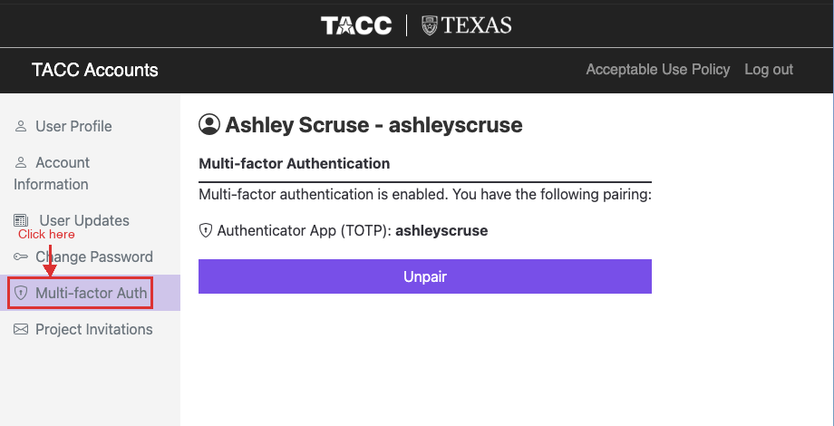
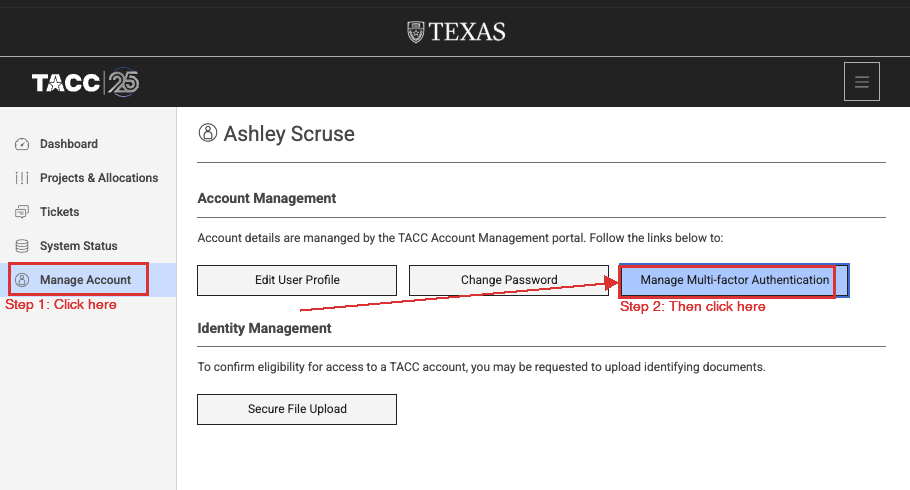
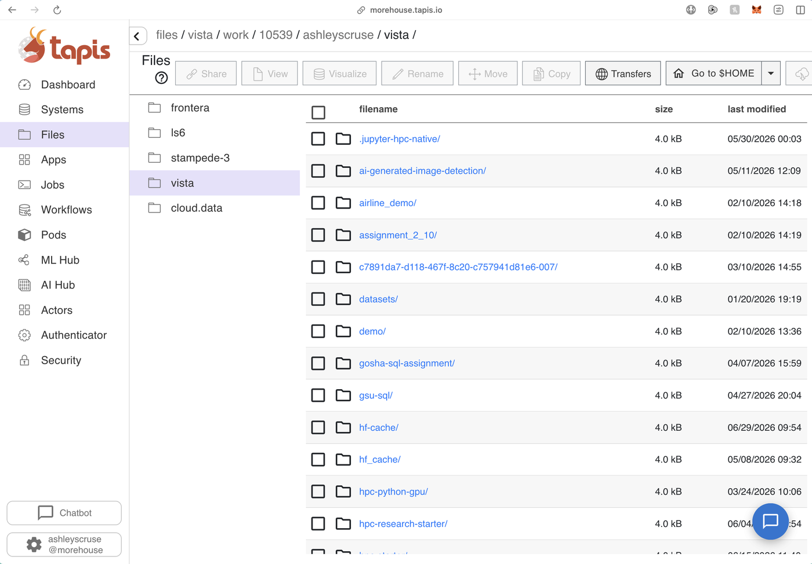

**Morehouse Supercomputing Facility (MSF) · HPC Office Hours**

One goal: get you onto the supercomputer, from the terminal or from Tapis, and show you around once you are there.

| | |
|---|---|
| **System** | `vista.tacc.utexas.edu` |
| **Allocation** | `TRA25001` |
| **CPU queue** | `gg` · 144 cores per node |
| **GPU queues** | `gh` · `gh-dev` |
| **Architecture** | Arm (not x86) |

## On this page

**Part 1 · Get access**
1. [Request access and set up MFA](#1-get-access)

**Part 2 · Get on the system**

{:start="2"}
2. [Two ways on](#2-two-ways-on)
3. [Open your terminal](#3-the-terminal-is-an-app-you-open)
4. [What logging in looks like](#4-what-logging-in-actually-looks-like)
5. [Morehouse Tapis](#5-morehouse-tapis)

**Part 3 · Now that you are on**

{:start="6"}
6. [Login nodes vs. compute nodes](#6-login-nodes-vs-compute-nodes)
7. [Where your files live](#7-where-your-files-live)
8. [Get a compute node](#8-get-yourself-a-compute-node)

**Part 4 · When you are stuck**

{:start="9"}
9. [When it breaks](#9-when-it-breaks)
10. [Cheat sheet](#10-cheat-sheet)
11. [Getting help](#11-getting-help)

---

# Part 1 · Get access

## 1. Get access

Nothing else on this page works until this is done: request access, make the account from the invitation email, then set up multi-factor. Having a TACC account and being on the allocation are two different things.

### Start with the request form

Everything begins here. Fill this out and we add you to the project on our end.

**[Request access to the MSF allocation →](https://docs.google.com/forms/d/e/1FAIpQLSdxkIzSFhd06isO-uYSwph7Dj_BawzWFvoBMQAiUwqn0iUS4g/viewform)**

You only do this once. If you are not sure whether you already have, run `/usr/local/etc/taccinfo` on Vista, or just ask.

### Then use the invitation link, not the sign-up page

Once the form is in, TACC emails you an invitation with the subject **"TACC Project Invitation Action Required: Account Request"**. Open that email and click through from there.

> **Do not register separately.** Making an account on the TACC site on your own produces an account with no project attached, and then nothing you submit will run. The invitation link is what ties your new account to the allocation. If you already made one that way, tell us and we will link it up.

On the registration form, use your institutional email, and pick a username you will still be happy with in five years. It is permanent, and it is what you type at every login.

### Set up multi-factor before your first login

MFA is required on every login, including SSH. Set it up first or your first connection attempt will simply fail. Two routes to the same page:

**Option A.** Go to [accounts.tacc.utexas.edu](https://accounts.tacc.utexas.edu/) and click **Multi-factor Auth** in the left sidebar.



**Option B.** From [portal.tacc.utexas.edu](https://portal.tacc.utexas.edu/), click **Manage Account** in the sidebar, then **Manage Multi-factor Authentication**.



On that page, pair an authenticator app. Which one you pick matters more than people expect.

| | App | Verdict |
|---|---|---|
|  | **Okta Verify** | **Highly recommended.** Pairs cleanly and keeps working. This is the one to install. |
|  | **Duo Mobile** | **Works.** A fine second choice, and the one to use if your institution already requires it. |
|  | **Microsoft Authenticator** | **Avoid.** It has repeatedly failed to pair for participants, and the failure looks like an account problem, which makes it slow to diagnose. |

> **Please skip SMS and Microsoft Authenticator.** Text-message codes are not a supported option here. If you have already paired either one and logins are failing, unpair it on the MFA page and pair Okta Verify instead.

Once you are paired, test it: log out of the portal and back in. Do that before you try the terminal, so that if something is wrong you find out in a browser rather than at a password prompt.

> **Confirm you are actually on the allocation.** After your first login, run `/usr/local/etc/taccinfo` (or just `allocations`). If `TRA25001` appears with hours remaining, you are set. An empty list means you have an account but no project, which is the one thing we have to fix on our end.

**Manage your account.** After setup, [portal.tacc.utexas.edu](https://portal.tacc.utexas.edu/) is what you come back to: check your project membership, see how much allocation is left, or re-pair a lost authenticator.

---

# Part 2 · Get on the system

## 2. Two ways on

There are two front doors to the same machine and the same files. What differs is how much you have to install, where you land, and how much control you get once you are there.

| | **Terminal (SSH)** | **Morehouse Tapis** |
|---|---|---|
| **Where** | `vista.tacc.utexas.edu` | [morehouse.tapis.io](https://morehouse.tapis.io) |
| **What it is** | A text connection from an app already on your computer. The real machine with nothing in between. | Our own web interface, with a GPU Jupyter app already built and pointed at Vista. |
| **To install** | Nothing on Mac or Linux. On Windows, Git Bash. | Nothing |
| **You land on** | A login node. Ask for a compute node yourself. | A compute node |
| **You get** | A command prompt. All of it. | Files, apps, jobs, and Jupyter on a GPU node. |
| **Best for** | Anything real, and everything you will read about later. | Browsing files, our GPU work, and automating later. |

> **You do not have to pick one forever.** Most people end up using both: Tapis for browsing and notebooks, and the terminal for everything else. The files are the same either way: upload something through Tapis and it is right there in the terminal.

## 3. The terminal is an app you open

There is no website you go to for this part. The terminal is a program already on your computer, the same way Word or Chrome is. Find it, open it, and leave it open.

| System | App | How to open it | Notes |
|---|---|---|---|
| **macOS** | Terminal (built in) | Press `Cmd + Space`, type **Terminal**, press Enter. Also in Applications → Utilities. | SSH is already installed. |
| **Windows** | **Git Bash (recommended)** | Install Git for Windows from [git-scm.com/download/win](https://git-scm.com/download/win) with the defaults. Then press Windows, type **Git Bash**, and open it. | Start here on Windows. It avoids the connection error in section 4. |
| **Windows** | Windows Terminal / PowerShell | Press Windows, type **Windows Terminal** (Windows 11) or **PowerShell** (Windows 10). | Some builds fail with `Corrupted MAC on input`. If yours does, switch to Git Bash. |
| **Linux** | Terminal (built in) | Usually `Ctrl + Alt + T`. | SSH ships with essentially every distribution. |

> **Windows only: if `ssh` is not recognized.** If `ssh -V` answers *The term 'ssh' is not recognized*, the OpenSSH client is switched off. Turn it on in **Settings → Apps → Optional Features → Add a feature**, search **OpenSSH Client**, install, then close and reopen PowerShell. Or run PowerShell as Administrator and use `Add-WindowsCapability -Online -Name OpenSSH.Client~~~~0.0.1.0`. On a locked-down laptop where neither is allowed, use MobaXterm instead.

**Windows alternatives, if you want one**

| Tool | Best for |
|---|---|
| **Git Bash** | Start here. A real bash shell, the same `ssh` as macOS and Linux, and not affected by the Corrupted MAC error. |
| **Windows Terminal** | Fine when it works. Some builds fail with Corrupted MAC on input. |
| **MobaXterm** | New to the command line, or you want a drag-and-drop file browser in a side panel. Free from [mobaxterm.mobatek.net](https://mobaxterm.mobatek.net). |
| **WSL** | Already comfortable in Linux. Install Ubuntu from the Microsoft Store. |
| **PuTTY** | Older or heavily restricted machines. Free from [putty.org](https://putty.org). |

Pick one and stay on it. Switching tools halfway through a session is how people lose an hour.

## 4. What logging in actually looks like

The command is identical on every system. Only the window around it changes. Type your username in place of `yourusername`.

**macOS and Linux**

```
yourname@MacBook-Pro ~ % ssh yourusername@vista.tacc.utexas.edu
The authenticity of host 'vista.tacc.utexas.edu' can't be established.
Are you sure you want to continue connecting (yes/no/[fingerprint])? yes
Password:
TACC Token Code:
------------------------------------------------------------
   Welcome to the Vista Supercomputer
------------------------------------------------------------
login1.vista(1)$
```

The prompt on the last line ends in `login1`, which tells you that you are on a login node, not a compute node. See section 6 for why that matters.

**Windows**

```
PS C:\Users\YourName> ssh -V
OpenSSH_for_Windows_8.6p1, LibreSSL 3.4.3
PS C:\Users\YourName> ssh yourusername@vista.tacc.utexas.edu
Password:
TACC Token Code:
login1.vista(1)$
```

Once you are connected, the prompt changes from `PS C:\Users\YourName>` to the Vista prompt. From that point on you are typing Linux commands, not PowerShell commands.

> **Nothing appears when you type your password.** No characters, no dots, no asterisks. The cursor does not move. This is deliberate, and it is the single most common reason a new user thinks the terminal has frozen. Type it carefully and press Enter. The same applies to the MFA token on the next line.

The host fingerprint question only appears on your very first connection from that computer. Type `yes`, in full, and you will not be asked again.

### Windows: "Corrupted MAC on input"

You answer `yes` to the fingerprint question, and instead of a password prompt you get this:

```
Warning: Permanently added 'vista.tacc.utexas.edu' (ED25519) to the list of known hosts.
Corrupted MAC on input.
ssh_dispatch_run_fatal: Connection to 64:ff9b::8172:3ec9 port 22: message authentication code incorrect
```

> **This is not your account, your password, or your typing.** It is a bug between certain Windows OpenSSH builds and the network path. Retrying will not fix it, and neither will resetting your password. Switch terminals instead.

**The fix: use Git Bash**

1. Install Git for Windows from [git-scm.com/download/win](https://git-scm.com/download/win) and accept the defaults.
2. Press Windows, type **Git Bash**, and open it.
3. Run the same command as before: `ssh yourusername@vista.tacc.utexas.edu`

That is the whole fix. Everything else on this page works identically from Git Bash.

**Or use PuTTY**

1. From [putty.org](https://putty.org), download the 64-bit MSI installer and run it with the defaults.
2. Open PuTTY. In **Host Name** enter `vista.tacc.utexas.edu`. Leave **Port** at 22 and **Connection type** on SSH.
3. Click **Open**. A security alert about the host key appears the first time. Click **Accept**.
4. At `login as:` type your username, then your password and MFA code. The same silent-input rule applies.

### Other systems

Our allocation is on Vista. The same command works with a different hostname if you have time on another system.

| System | Hostname | Notes |
|---|---|---|
| **Vista** | `vista.tacc.utexas.edu` | Arm, Grace Hopper GPUs. Our allocation, `TRA25001`. |
| **Frontera** | `frontera.tacc.utexas.edu` | x86 |
| **Stampede3** | `stampede3.tacc.utexas.edu` | x86 |

## 5. Morehouse Tapis

We run our own Tapis tenant at [morehouse.tapis.io](https://morehouse.tapis.io). It is two things at once: a web interface for your files, apps, and jobs, and an API underneath for driving Vista from code.



The **Systems** column is where you switch between storage systems. **Files** is where you browse and upload; anything you upload here is the same file you see from the terminal. **Apps** and **Jobs** in the sidebar are where you submit work and then watch it run.

### Launching Jupyter on a GPU node

In the Tapis UI, find the `jupyter-hpc-native` app and submit it with the JSON form. The whole request is one line, because the app already knows the system, the queue, and the setup script.

```json
{ "name": "jupyter", "appId": "jupyter-hpc-native", "appVersion": "vista" }
```

Add `"maxMinutes": 60` to cap the session at an hour. The default is 120, and a shorter session spends less of the allocation.

> **Do this once, before your first submission.** The app copies a setup script from a storage system called `cloud.data`. Without credentials there, your job hangs on `STAGING_INPUTS` forever and never fails visibly.
>
> To check: open **Files** in the Tapis UI, select `cloud.data`, browse to `/corral/tacc/aci/CEP/applications/v3/interactive-template/tap`, and confirm you can see `tap-ilogin.sh`. If you get `SSH_POOL_MISSING_CREDENTIALS`, your keys need verifying first.

**Then watch it move**

```
STAGING_INPUTS  →  SUBMITTING_JOB  →  QUEUED  →  RUNNING
```

Once the status reads `RUNNING`, give it another minute or two for the node to start the Jupyter server, then open the job's `tapisjob.out` file. Near the top is the line you need:

```
TACC: JUPYTER_URL is https://vista.tacc.utexas.edu:60707/?token=cb137c89...
```

Copy that whole URL, token included, into your browser. That is JupyterLab on a Vista GPU node, serving from your `$WORK` directory. Confirm the GPU with `!nvidia-smi` in a cell.

> **Two harmless things that look like errors.** Clicking into the output view before the job runs gives "path not found", because the output folder does not exist yet. And the log's other URLs, the ones ending in `:8888` or `127.0.0.1`, are the node's internal addresses; they will not work from your laptop. Only the `JUPYTER_URL` line works.

### The API underneath

The same tenant exposes REST services for Systems, Files, Apps, and Jobs. Reach for this once you find yourself submitting the same job repeatedly from a script, a web app, or a notebook that is not on the cluster.

```python
# pip install tapipy
import os
from tapipy.tapis import Tapis

t = Tapis(base_url="https://morehouse.tapis.io",
          username="yourusername",
          password=os.environ["TACC_PASSWORD"])
t.get_tokens()
t.systems.getSystems()   # what can I reach?
t.jobs.getJobList()      # what have I run?
```

Never paste your password into a notebook you will commit. Read it from an environment variable or a `.env` file that is in your `.gitignore`. Full reference at [tapis.readthedocs.io](https://tapis.readthedocs.io).

---

# Part 3 · Now that you are on

## 6. Login nodes vs. compute nodes

Before you run anything, understand this one thing, because it is the source of most office-hours questions.

Vista is not one computer; it is two kinds of computer. A **login node** is the shared front desk: you land on one when you connect, and there are only a handful of them for thousands of users. The **compute nodes** are the actual supercomputer, hundreds of them, and you never touch one directly. You ask the scheduler, Slurm, for one.

Which door you use decides where you start. The terminal puts you on a login node, so you have to ask for a compute node yourself. Tapis puts you on a compute node from the outset.

| | On a login node | On a compute node |
|---|---|---|
| **Do** | Edit files, move around, submit jobs, check the queue, short compiles, small file transfers. | Training runs, simulations, long compiles, anything that eats memory or runs for minutes. |
| **Commands** | `ls` · `cd` · `nano` · `idev` · `squeue` | an `idev` session · a Tapis job |

> **What gets your account suspended.** Running `python train.py` straight after logging in. It executes on the login node, slows the machine for everyone, and system monitoring will kill it and email you. The fix is one line: ask for a compute node first with `idev`, and run your work there.

To tell where you are, read your prompt. Login nodes are named like `login1`; compute nodes have a number like `c123-456`.

## 7. Where your files live

However you got on, you are looking at the same three filesystems, and they have genuinely different rules.

| Directory | Size | Backed up | Purged | Put this here |
|---|---|---|---|---|
| `$HOME` | 23 GB | Yes | Never | Code, scripts, small configs, final results worth keeping. |
| `$WORK` | 1 TB | No | Never | Datasets, environments, the project you are actively working on. |
| `$SCRATCH` | Unlimited | No | 10 days | Job output, checkpoints, intermediates you can regenerate. |

> **Read this twice.** `$SCRATCH` is purged. Files not touched in ten days are deleted, and they are not recoverable. It is the right place to write job output and the wrong place to leave it. `$WORK` is not backed up either, so keep your own copy of anything you cannot regenerate.

Use the variables, not typed-out paths. `cd $WORK` works on every system; a hard-coded path breaks the moment you move.

```bash
cd $WORK && mkdir -p myproject/{data,scripts,logs,results}
du -sh $HOME                 # am I near the 23 GB quota?
/usr/local/etc/taccinfo      # allocation + usage
```

## 8. Get yourself a compute node

`idev` asks the scheduler for a compute node and drops you into a shell on it for a fixed window. Everything you type after that is running on the supercomputer rather than on the front desk.

```bash
# 30 minutes on one CPU node
idev -p gg -N 1 -t 00:30:00

# one GPU node, dev queue: shorter limit, starts fastest
idev -p gh-dev -N 1 -t 00:30:00 -A TRA25001
```

| Queue | Hardware | Reach for it when |
|---|---|---|
| `gg` | Grace-Grace, CPU only, 144 cores per node | No GPU needed. Parallel CPU work, data processing. |
| `gh` | Grace Hopper, GPU | Real training and inference runs. |
| `gh-dev` | Grace Hopper, GPU, short limit | Debugging. Shortest wait to get a node. |

Ask for the time you actually need. A 30-minute request often starts immediately when a 4-hour request would sit in the queue, and the session ends the moment your clock runs out whether or not your work finished. Type `exit` to give the node back early.

### Loading software once you are there

Nothing is installed by default. Software is loaded on demand, so incompatible versions never collide and you can pin exactly what you need.

```bash
module spider python   # what versions exist?
module load python3    # load one
module list            # what do I have loaded?
module reset           # escape hatch, back to defaults
```

> **Vista is Arm, not x86.** Grace Hopper is an Arm architecture. A pip wheel or conda build compiled for x86 will install cleanly and then fail at import. If a package misbehaves, check you have the `aarch64` build before debugging anything else.

---

# Part 4 · When you are stuck

## 9. When it breaks

**Nothing appears when I type my password.**
Working as designed. The terminal never echoes a password or an MFA token. Type it and press Enter.

**Corrupted MAC on input / message authentication code incorrect.**
A Windows OpenSSH bug, not your account. Use Git Bash or PuTTY instead of PowerShell. Walkthrough in section 4.

**`ssh` is not recognized as a command.**
Windows, with the OpenSSH client switched off. See section 3.

**Permission denied, or it asks for the password over and over.**
Usually the MFA code, not the password. Codes expire in 30 seconds, so wait for a fresh one. Three failures in a row can trigger a temporary lockout; wait a few minutes before retrying.

**I made an account but nothing will run.**
You probably registered directly instead of through the invitation email, so the account has no project attached. Run `/usr/local/etc/taccinfo`. If the project list is empty, send us your username, and check you actually submitted the request form in section 1.

**"Invalid account" or "Invalid partition" when I ask for a node.**
You are not on the allocation, or the `-A` line is wrong. Check with `/usr/local/etc/taccinfo` that `TRA25001` is listed.

**My job has been Pending forever.**
The queue is busy. Ask for less: fewer nodes, less wall time, or `gh-dev` instead of `gh`.

**Command not found, for something I know is installed.**
You have not loaded its module in this session. Run `module spider <name>` to find it, then `module load` it. A fresh `idev` session starts clean every time.

**Illegal instruction, or a wheel installs then fails at import.**
An x86 build on an Arm machine. Get the `aarch64` version of the package.

**Disk quota exceeded.**
`$HOME` is only 23 GB and virtual environments fill it fast. Run `du -sh $HOME/*` to find the culprit, then move the project to `$WORK`.

**My files are gone.**
Were they in `$SCRATCH`? It purges after 10 days and there is no recovery. Anything you cannot regenerate belongs in `$WORK` or `$HOME`.

**My job got killed and I got an email.**
You ran something heavy on a login node. Not a big deal the first time. Use `idev` and it will not happen again.

**My Tapis job is stuck on `STAGING_INPUTS`.**
The key check in section 5 was skipped. Verify you can see `tap-ilogin.sh` on `cloud.data`, then resubmit.

**Jupyter cannot see my data.**
You are in `$HOME`. Open a terminal in JupyterLab and `cd $WORK`.

**My notebook kernel keeps dying.**
Out of memory, usually from loading a whole dataset into a dataframe. Restart the session with more resources, or read the data in chunks.

## 10. Cheat sheet

Everything here works the same in the terminal and in a Tapis Jupyter session.

**Where am I, what have I got**

| Command | What it does |
|---|---|
| `pwd` | Print the directory you are currently in. |
| `ls -la` | List everything here, including hidden files, with sizes and dates. |
| `cd $WORK` | Go to the project filesystem. Most of your work lives here. |
| `du -sh $HOME` | How much of the 23 GB home quota you have used. |
| `allocations` | Your projects and how much time is left on each. |
| `hostname` | Which node you are on. `login1` means a login node. |

**Moving around and handling files**

| Command | What it does |
|---|---|
| `mkdir -p a/b/c` | Create a folder, and any parent folders it needs. |
| `cp -r src dst` | Copy a folder and everything inside it. |
| `mv old new` | Move a file, or rename it. Same command either way. |
| `less file` | Scroll through a file. Press `q` to quit. |
| `tail -f logfile` | Watch a file as it grows. `Ctrl-C` stops watching. |
| `wget https://...` | Download data straight onto Vista, no laptop involved. |

**Getting a compute node**

| Command | What it does |
|---|---|
| `idev -p gg -N 1 -t 00:30:00` | A CPU node for 30 minutes. |
| `idev -p gh-dev -N 1 -t 00:30:00` | A GPU node. Shortest wait of the three queues. |
| `hostname` | Confirm it worked. `c123-456` is a compute node, `login1` is not. |
| `exit` | End the session and give the node back. |
| `squeue -u $USER` | Anything of yours still queued or running. |

**Loading software**

| Command | What it does |
|---|---|
| `module spider python` | Find every available version of something. |
| `module load python3` | Load it into this session. |
| `module list` | What is loaded right now. |
| `module reset` | Back to the system default when things get tangled. |

**Editing a file on Vista**

| Command | What it does |
|---|---|
| `nano notes.txt` | The simplest editor. Start here. |
| `Ctrl-O` then `Ctrl-X` | Save, then exit nano. |
| `vim notes.txt` | The other one. You will meet it eventually. |
| `i` / `Esc` / `:wq` | In vim: start typing, stop typing, then save and quit. |

## 11. Getting help

**Bring this to office hours and we start at the answer**

1. Which door you were using: terminal or Tapis.
2. The exact command you ran, copied, not retyped from memory.
3. The exact error, copied the same way. A screenshot is fine.
4. Your username, and the output of `/usr/local/etc/taccinfo` if you got that far.

| Where | For |
|---|---|
| [MSF Getting Started](https://morehouse-supercomputing.github.io/mscf-getting-started/) | The full onboarding guide, with OS tabs and troubleshooting. |
| [Jupyter via Tapis](https://morehouse-supercomputing.github.io/jupyter-on-tapis/) | The long-form version of section 5. |
| [docs.tacc.utexas.edu/hpc/vista](https://docs.tacc.utexas.edu/hpc/vista/) | The Vista user guide. Authoritative on hardware, queues, and limits. |
| [portal.tacc.utexas.edu](https://portal.tacc.utexas.edu/) | Account, MFA, project membership, allocation balance. |
| [help@tacc.utexas.edu](mailto:help@tacc.utexas.edu) | Hardware faults, filesystem problems, anything system-wide. Include your username and the job id. |
| MSF office hours | Everything else. Your setup, your code, your job script. |

While our own facility is being built, TACC is our partner providing the compute time, which is why the links on this page point at their systems.
